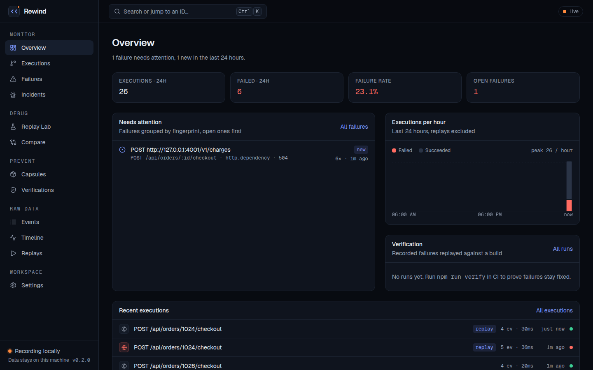
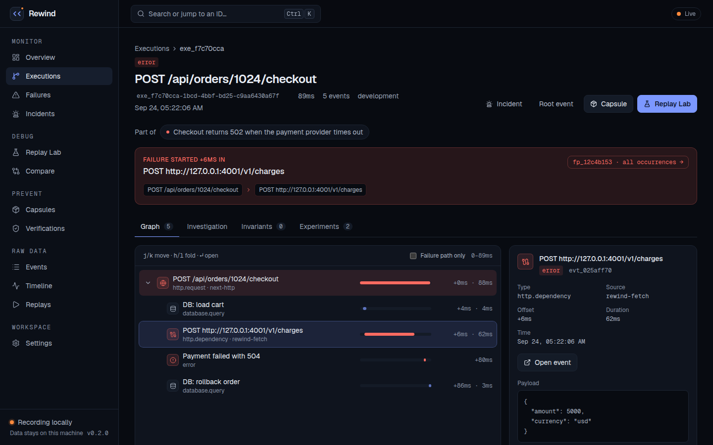
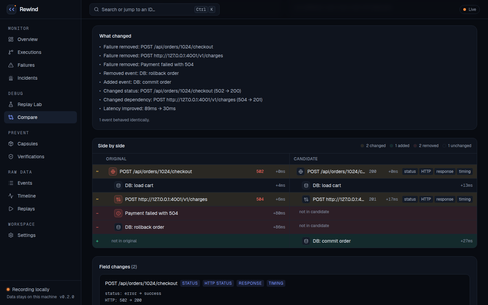
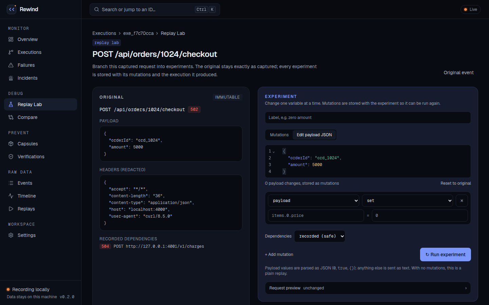
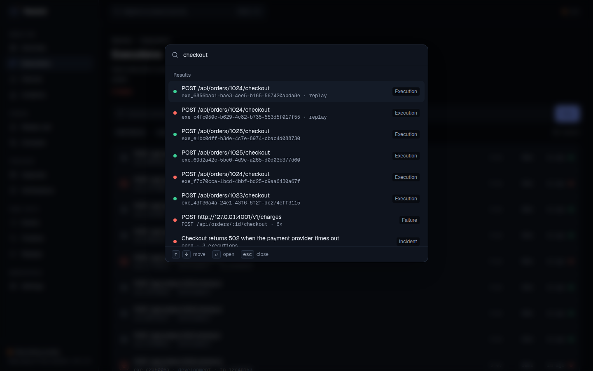

# Rewind

**A flight recorder for your app.** Rewind records every request and everything it caused, then lets you replay a failure safely, change one thing, see exactly what changed, and prove the bug never comes back.

Open source · self-hosted · one SQLite file · nothing leaves your machine.



```text
Capture  →  Understand  →  Reproduce  →  Fix  →  Prevent
 request     graph and      replay with     diff     verify in CI
 + events    failure origin recordings     vs. last  on every PR
                                           good run
```

---

## Quick start

**Docker**

```bash
git clone <repository-url> && cd rewind
docker compose up --build
```

**Node.js 22+**

```bash
npm install
npm run dev          # http://localhost:3000
npm run seed         # optional: demo data
```

Open **http://localhost:3000**. A setup checklist on the Overview walks you through the rest.

---

## Capture your app

**Any language:** send events to the HTTP API.

```bash
curl -X POST http://localhost:3000/api/events \
  -H "Content-Type: application/json" \
  -d '{"type":"http.request","title":"POST /api/checkout","status":"error"}'
```

**Next.js / TypeScript:** wrap route handlers, and use `rewindFetch` for outgoing calls so replays can answer from the recording instead of calling Stripe again.

```ts
import { withRewindCapture } from "@/lib/rewind-http";
import { rewindFetch } from "@/lib/rewind-fetch";

export const POST = withRewindCapture(async (request) => {
  const charge = await rewindFetch("https://api.stripe.com/v1/charges", {
    method: "POST",
    body: JSON.stringify({ amount: 4999 }),
  });

  return Response.json({ ok: charge.ok });
});
```

The helpers live in `src/lib` (`rewind.ts`, `rewind-http.ts`, `rewind-fetch.ts`); copy them into your app and set `REWIND_CAPTURE_URL`. **Webhooks:** point the sender at `POST /api/webhooks/capture`.

---

## What you get

| Page | What it's for |
| --- | --- |
| **Overview** | What needs attention right now: open failures, executions per hour, CI runs |
| **Executions** | Every request as a tree of what it caused, with timing. Filter with `status:error endpoint:/checkout since:24h -is:replay` |
| **Failures** | Failures grouped by root cause (fingerprint), with a 14-day trend and the last good run |
| **Incidents** | Group related executions, keep notes, mark resolved |
| **Replay Lab** | Replay a captured request, edit its payload as JSON, preview it, run it |
| **Compare** | Two executions side by side: what was added, removed or changed |
| **Capsules** | Export a failure as one verified file; import it anywhere to reproduce |
| **Verifications** | Recorded failures replayed against a new build: fixed or not? |
| **Settings** | Extra redaction rules, replay defaults, theme and density |

<table>
  <tr>
    <td></td>
    <td></td>
  </tr>
  <tr>
    <td align="center"><sub>Every request as a tree of what it caused</sub></td>
    <td align="center"><sub>A failure and its fix, side by side</sub></td>
  </tr>
  <tr>
    <td></td>
    <td></td>
  </tr>
  <tr>
    <td align="center"><sub>Replay Lab: change one thing, run it again</sub></td>
    <td align="center"><sub>⌘K: search anything, jump to any ID</sub></td>
  </tr>
</table>

**Keyboard:** `⌘K` / `Ctrl+K` search and jump to any ID · `g` then a letter to switch page (`g e` executions, `g f` failures…) · `j`/`k` in the graph · `?` for all shortcuts.

**Live:** new executions appear as they happen, and a new failure raises a toast.

---

## Replays are safe by default

- **Localhost only.** Replays go to `REWIND_REPLAY_BASE_URL` and never to a remote host.
- **Dependencies answer from the recording.** Payments, emails and other side effects are not repeated. Choose `blocked` to fail outgoing calls, or `live` explicitly per experiment.
- **The original is never changed.** Every experiment is stored with its exact mutations, so it can be re-run.

---

## Prove it stays fixed (CI)

```bash
npm run verify -- capsules/*.rewind.json --target http://localhost:4000
```

This replays recorded failures against your build. It exits `1` if any failure still reproduces. On GitHub Actions it writes a results table to the job summary and annotates each failure. See [`docs/ci/rewind-verify.yml`](docs/ci/rewind-verify.yml) for a complete workflow.

---

## Configuration

All optional.

| Variable | Default | Purpose |
| --- | --- | --- |
| `REWIND_ACCESS_TOKEN` | *(unset: open)* | Require a token for every page and API. Set it on Rewind **and** on apps that capture to it |
| `REWIND_DB_PATH` | `data/rewind.db` | Where the SQLite database lives |
| `REWIND_REPLAY_BASE_URL` | `http://localhost:3000` | The local app that replays are sent to |
| `REWIND_CAPTURE_URL` | `http://localhost:3000/api/events` | Where capture helpers send events |
| `REWIND_URL` | `http://localhost:3000` | The Rewind server `npm run verify` talks to |

`GET /api/health` reports the running version and whether the database is readable; the Docker image uses it as its health check.

---

## Security and privacy

- **Your data stays local.** Everything is stored in one SQLite file. Rewind sends nothing to third parties, and Next.js telemetry is off in Docker.
- **Secrets are redacted before storage.** This covers auth headers, cookies, API keys, tokens, passwords, card numbers, and credentials in URLs. Add your own header and field names in Settings. They can only add redaction, never remove it.
- **Open by default, for local use.** Before exposing Rewind on a network, set `REWIND_ACCESS_TOKEN`. People then sign in at `/login`; capture clients and CI send the token as a bearer header, and webhook senders add `?token=`, which is redacted before storage. Failed attempts are rate limited.
- **Hardened API.** Request bodies are size-limited, malformed input gets a 400, and error details stay in the server log.
- **Not indexed.** `robots.txt` and a `noindex` tag keep an exposed instance out of search engines.

Found a vulnerability? See [SECURITY.md](SECURITY.md).

---

## Development

```bash
npm test             # Vitest, on a temporary database
npm run build        # production build
npm run lint
```

```text
src/app         pages and API routes (/api/events, /api/executions, /api/replay, …)
src/components  UI, grouped by feature; shared primitives in ui/
src/lib         capture SDK, execution graph, diff, replay, redaction, storage
scripts         seed data and the verify CLI
docs            full reference, CI example, handoff notes
```

Built with Next.js 16, React 19, Tailwind CSS 4, SQLite (better-sqlite3), Radix UI, cmdk and CodeMirror.

---

## Learn more

- **[Full reference](docs/REFERENCE.md):** every feature, endpoint, table and option in detail
- **[Changelog](CHANGELOG.md):** what changed in each release
- **[Handoff notes](docs/HANDOFF.md):** design decisions and known limitations

## License

[MIT](LICENSE)
